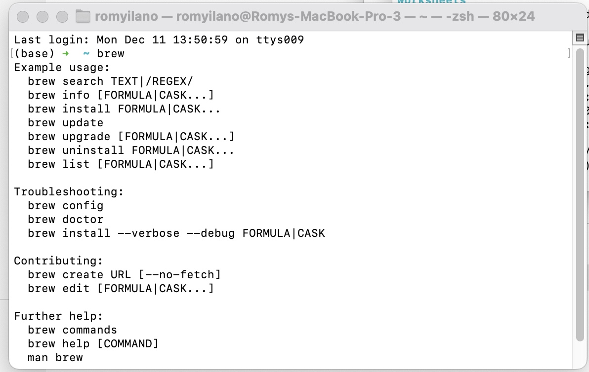

# Mac Install

Here's a summary of installing everything on an Apple Silicon Macbook - these are the M1 or M2 models.

Source: [Installation on Apple Silicon](https://github.com/AUTOMATIC1111/stable-diffusion-webui/wiki/Installation-on-Apple-Silicon)

# Get Homebrew

[Homebrew](https://brew.sh) is a package manager that "installs the stuff you need that Apple (or your Linux system) didn't."

## Check if you have Homebrew

* Open the terminal
* Type `brew`

If you have homebrew you'll see this screen:

## Install Homebrew if you don't have it

If you don't see that screen install homebrew by typing this in the command line

`/bin/bash -c "$(curl -fsSL https://raw.githubusercontent.com/Homebrew/install/HEAD/install.sh)"`

# Install Stable Difussion

See [automatic installation section](https://github.com/AUTOMATIC1111/stable-diffusion-webui/wiki/Installation-on-Apple-Silicon#automatic-installation)

* Open a new terminal window and type `brew install cmake protobuf rust python@3.10 git wget`
* Clone the stable diffusion web UI repo by typing `git clone https://github.com/AUTOMATIC1111/stable-diffusion-webui`

Cool! Now you have the UI software but now we need to get Stable Diffusion Models

# Download Stable Diffsion Models

[Hugging Face](https://huggingface.co/models?pipeline_tag=text-to-image&sort=downloads) has a bunch of Stable Diffusion models that you can download. 

You can take your pick at the different versions of Stable Diffusion models available. Some are optimized to be leaner and meaner and work on different kinds of computers. 

### About the Checkpoint file format

The Stable Diffusion [files on Hugging Face](https://huggingface.co/models?pipeline_tag=text-to-image&sort=downloads) are going to have the `.ckpt` file format which stands for "checkpoint"  

You'll hear people saying "download checkpoint" or "download a model") 

_There's a fun [reddit discussion](https://www.reddit.com/r/StableDiffusion/comments/12dunfr/what_is_inside_a_checkpoint_file/) on what is inside a checkpoint file on `/r/StableDifussion_

### Download the Actual File

* Go to https://huggingface.co/models?pipeline_tag=text-to-image&sort=downloads
* Click a model
* Click on `Files and Versions` header
* Search for files with `.ckpt` or `.safetensors`
* Click down arrow to the right to download them

#### Popular Stable Diffusion Models

Some popular official Stable Diffusion models are:

* [Stable Diffusion 1.4](https://huggingface.co/CompVis/stable-diffusion-v-1-4-original) ([sd-v1-4.ckpt](https://huggingface.co/CompVis/stable-diffusion-v-1-4-original/resolve/main/sd-v1-4.ckpt))
* [Stable Diffusion 1.5](https://huggingface.co/runwayml/stable-diffusion-v1-5) ([v1-5-pruned-emaonly.ckpt](https://huggingface.co/runwayml/stable-diffusion-v1-5/resolve/main/v1-5-pruned-emaonly.ckpt))
* [Stable Diffusion 1.5 Inpainting](https://huggingface.co/runwayml/stable-diffusion-inpainting) ([sd-v1-5-inpainting.ckpt](https://huggingface.co/runwayml/stable-diffusion-inpainting/resolve/main/sd-v1-5-inpainting.ckpt))

Source: [Downloading Stable Diffusion Models](https://github.com/AUTOMATIC1111/stable-diffusion-webui/wiki/Installation-on-Apple-Silicon#downloading-stable-diffusion-models)

